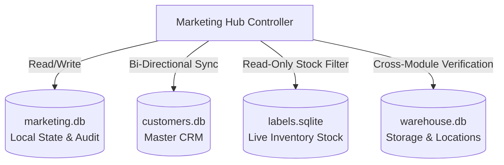

# Marketing Hub Architecture & Engineering Blueprint
*Last Updated: September 5, 2026 10:52 PM*

## 🌐 Overview
The **Marketing Hub** is an enterprise sub-application within the IQA Warehouse Systems. It powers inventory-driven outbound sales, lead tracking, hardware model standardization, multi-channel marketing campaigns, and centralized hardware photography.

It is engineered as a **modular, zero-trust, zero-dependency** system that operates reliably on internal intranet servers (XAMPP / Apache / PHP 8.x) while synchronizing seamlessly with the warehouse inventory and CRM databases.

---

## 📁 Directory Structure
```text
marketing/
├── assets/
│   ├── css/                  # Design tokens, themes, and layout styling (main.css)
│   ├── js/                   # Vanilla JavaScript utilities and real-time handlers
│   └── photo_bucket/         # Generated raw, optimized, and thumbnail WebP photography
├── config.php                # Environment paths, DB handles, role access, and security init
├── data/
│   └── marketing.db          # Local SQLite database (templates, campaigns, photos, audit)
├── docs/                     # System specifications, SOPs, and developer guidelines
├── includes/
│   ├── db.php                # PDO connection handles, self-healing migrations, audit helpers
│   ├── header.php            # Shared responsive navigation and portal topbar
│   ├── footer.php            # Shared scripts, notifications, and closing markup
│   └── photo_processor.php   # GD-based WebP image optimization and thumbnail generator
├── index.php                 # Front controller and strict module router
└── modules/                  # Isolated, self-contained functional feature blocks
    ├── ad_generator/         # Stock-to-Ad multi-tone copy generator
    ├── campaigns/            # Marketing initiatives and outreach tracker
    ├── dashboard/            # Executive command center and inventory insights
    ├── docs/                 # Built-in documentation reader & knowledge base
    ├── leads/                # CRM-integrated prospective client management
    ├── manifest/             # Inventory manifest generation service class
    ├── model_templates/      # Hardware specifications & standardized marketing copy
    ├── photo_bucket/         # Centralized hardware photography vault
    └── reports/              # Conversion funnel and warehouse coverage metrics
```

---

## 🔑 Core Architectural Principles

1. **Strict Module Isolation**: Each feature resides entirely within its own `modules/<name>/` directory. The front controller (`index.php`) enforces an explicit whitelist (`$allowed_modules`) to prevent unauthorized file execution or directory traversal.
2. **Zero-Trust Security**: Every request undergoes session verification, Role-Based Access Control (RBAC), CSRF validation on mutations, output escaping via `h()`, and parameterized PDO queries.
3. **Self-Healing Database Engine**: Database schema creation and column/index migrations run automatically on connection initialization inside [`marketing/includes/db.php`](file:///c:/Users/Laptop/Desktop/WarehouseSystems-main/marketing/includes/db.php). No manual SQL setup scripts are required.
4. **Master CRM Single Source of Truth**: All contacts and leads synchronize bi-directionally with the primary company CRM database (`customers.db`), maintaining uniform `CUST-XXXXXXXX` customer identifiers.
5. **Centralized Audit Trail**: Every data mutation across templates, leads, campaigns, and photos records an immutable entry in the `marketing_audit` table.
6. **Graceful Degradation**: External dependencies (such as the PHP GD extension for image processing or optional database read replicas) degrade gracefully with informative user feedback rather than breaking the application.

---

## 🧩 Modules Overview

| Module | Purpose | Key Data Sources |
| :--- | :--- | :--- |
| **Dashboard** (`dashboard`) | Executive command center showing smart inventory sales opportunities, conversion rates, and recent activity. | `marketing.db`, `labels.sqlite`, `customers.db` |
| **Leads** (`leads`) | CRM contact management supporting lead intake, stage progression, touchpoint tracking, and Master CRM synchronization. | `customers.db`, `marketing.db` |
| **Model Templates** (`model_templates`) | Canonical hardware catalog defining base specs, marketing hero descriptions, and tracking asset coverage across photo angles. | `marketing.db` (`model_templates`, `photos`) |
| **Ad Generator** (`ad_generator`) | Real-time copy generator creating tailored outreach formats (Manifest, Urgency/Flash Sale, Social) matched against current warehouse stock levels. | `marketing.db`, `labels.sqlite`, `photos` |
| **Photo Bucket** (`photo_bucket`) | Centralized photo management for hardware listings, featuring drag-and-drop upload, model linking, and automated WebP thumbnailing. | `marketing.db` (`photos`), filesystem |
| **Campaigns** (`campaigns`) | Campaign planning, multi-platform status tracking, and ROI auditing for marketing initiatives. | `marketing.db` (`campaigns`) |
| **Manifest Service** (`manifest`) | Standalone business logic class (`ManifestGenerator.php`) for programmatic bulk inventory formatting. | `labels.sqlite`, `marketing.db` |
| **Reports** (`reports`) | Visual performance analytics, lead conversion funnels, and warehouse inventory marketing coverage statistics. | `marketing.db`, `customers.db` |
| **Documentation Hub** (`docs`) | Integrated Markdown knowledge base rendering standard operating procedures, architectural specs, and API references. | `marketing/docs/`, `DOCS/`, `orders/DOCS/` |

---

## 🗄️ Multi-Database Architecture

The Marketing Hub operates on a multi-database topology designed to preserve system autonomy while enabling cross-department data intelligence:



1. **`marketing.db`** (Local SQLite):
   - Stores `model_templates`, `campaigns`, `photos`, and the immutable `marketing_audit` ledger.
   - Initialized and kept up to date via `init_marketing_db()` in `includes/db.php`.
2. **`customers.db`** (Master CRM):
   - Shared across Orders and Marketing modules.
   - Houses the canonical `customers` table with auto-assigned `CUST-` identifiers.
3. **`labels.sqlite`** (Live Warehouse Inventory):
   - Queried in real time by the Ad Generator and Dashboard to check quantity and location of available units (`status = 'In Warehouse'`).
4. **`warehouse.db`** (Warehouse Operations):
   - Provides location zoning and order batch context when auditing inventory allocations.

---

## 🖼️ Image Processing Pipeline (`PhotoProcessor`)

To keep marketing pages snappy and conserve warehouse network bandwidth, all uploaded photos pass through the `PhotoProcessor` utility:

1. **Raw Storage**: The original uncompressed image is saved with a sanitized unique timestamped filename in `assets/photo_bucket/`.
2. **Full Optimized Version**: Resized proportionally to a maximum width of 1920px and re-encoded to WebP format (quality 85) to deliver crisp visuals on high-DPI displays at 70% lower file size.
3. **Gallery Thumbnail**: Cropped to a uniform 150x150px square WebP thumbnail (quality 75) for high-speed rendering in data tables and image selector grids.
4. **GD Extension Check**: If the PHP GD extension is disabled in XAMPP (`php.ini`), the system falls back gracefully to raw photo paths without crashing.

---

## 🔒 Security Architecture

- **Session Hardening**: Sessions are strictly initialized with standard cookie protections in `config.php`.
- **Role-Based Access Control**: Supported roles include `Admin`, `Manager`, `Sales`, and `Marketing`. Unauthorized access triggers an immediate 403 response.
- **CSRF Token Guard**: Integrated with [`core/Security.php`](file:///c:/Users/Laptop/Desktop/WarehouseSystems-main/core/Security.php); every state-changing POST request requires `UI::csrf_field()` and `Security::validate()`.
- **SQL Injection Immunization**: 100% of SQL statements across all 4 database connections use parameterized PDO prepared statements.
- **XSS Defense**: Strict sanitization of dynamic content with `h()` prevents script injection into user profiles or ad templates.

---

## 💻 Technology Stack
- **Server Environment**: Apache / XAMPP on Windows Server or Windows 10/11 Pro.
- **Backend Language**: PHP 8.0+ (strictly avoiding deprecated dynamic properties or outdated constructs).
- **Database Engine**: SQLite3 via PHP PDO (with WAL mode enabled for high concurrency).
- **Frontend Stack**: Semantic HTML5, Vanilla JavaScript (ES6+), Modular Vanilla CSS utilizing CSS Custom Properties.
- **Dependencies**: None required (native PHP). Optional: PHP GD library (`extension=gd`) for WebP image processing.
