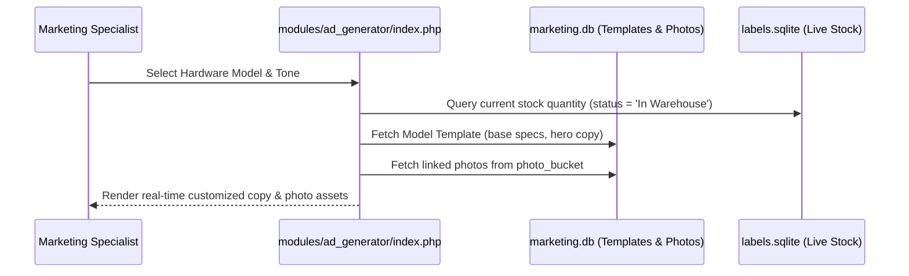

# Feature Specification: Ad Generator & Inventory Manifest Engine
*Last Updated: September 5, 2026 10:52 PM*

## 🎯 Objective
Empower the sales and marketing teams to instantly transform physical warehouse stock into targeted, high-converting marketing copy across multiple marketing channels without manual data entry.

---

## ⚙️ Architectural Workflow

The Ad Generator bridges operational warehouse data with marketing messaging:

---

## 📝 Generation Tones & Output Formats

The generator supports three distinct messaging tones:

### 1. Inventory Manifest (`manifest`)
- **Target Audience**: B2B Wholesale buyers, broker lists, enterprise procurement.
- **Style**: Structured, professional, and spec-focused.
- **Includes**: Quantity available, technical specs, certified condition, and direct contact call-to-action.

### 2. Urgency / Flash Sale (`urgency`)
- **Target Audience**: Quick-turn liquidations, limited batch availability, clearance blasts.
- **Style**: High-energy, emoji-driven, and time-sensitive.
- **Includes**: Prominent batch volume callouts, rapid shipping guarantee, and scarcity urgency.

### 3. Social / Community (`social`)
- **Target Audience**: LinkedIn hardware professionals, IT manager networks, homelab communities.
- **Style**: Conversational, value-focused, and informative.
- **Includes**: Use cases (enterprise virtualization, edge computing, office deployments), spec highlights, and discussion prompt.

---

## 🖼️ Photo Bucket Asset Integration

Alongside the generated ad copy, the Ad Generator displays live photography linked to the selected hardware model from the `photos` table:
- Displays up to 3 hero shots (Bulk Stack, Detail Quality, BIOS/Specs Proof).
- Provides instant "Copy Web URL" buttons for embedding photo links into email campaigns or marketplace listings.

---

## 🛠️ Code Architecture & Implementation

1. **Interactive UI Controller**:
   - Location: [`marketing/modules/ad_generator/index.php`](file:///c:/Users/Laptop/Desktop/WarehouseSystems-main/marketing/modules/ad_generator/index.php)
   - Features: Responsive split-view layout, dynamic stock badge indicators, one-click clipboard copy utility, and tone selector.
2. **Reusable Business Logic Service**:
   - Location: [`marketing/modules/manifest/ManifestGenerator.php`](file:///c:/Users/Laptop/Desktop/WarehouseSystems-main/marketing/modules/manifest/ManifestGenerator.php)
   - Methods:
     - `getMarketableInventory($minQty)`: Queries `labels.sqlite` for models exceeding minimum threshold.
     - `generateTextAd($inventory, $tier)`: Programmatically compiles bulk stock lists for automated email blasts.
3. **Database Integration**:
   - Matches model names between `labels.sqlite` (`items` table) and `marketing.db` (`model_templates` table) using parameterized PDO queries.
