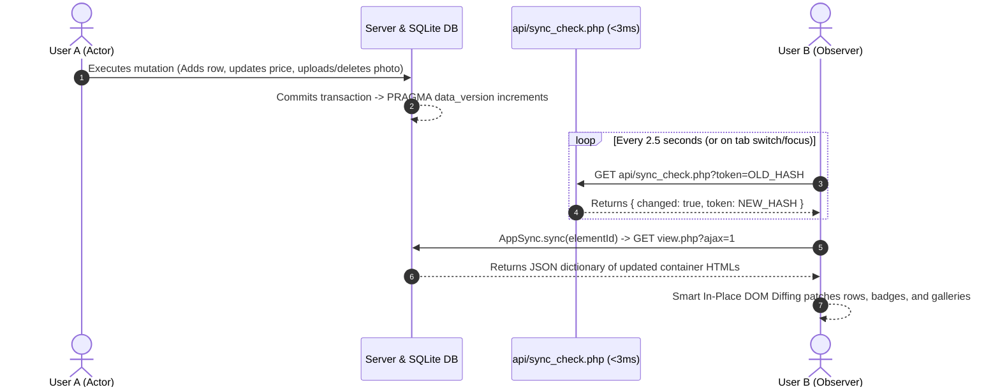

# ⚡ Real-Time Multi-User AJAX Synchronization & Smart Diffing Guide

> **Audience**: AI Agents and Software Engineers integrating new features or modules into the IQA Warehouse & Orders platform.
> **Core Principle**: Zero page reloads. Changes made by User A on any workstation must reflect automatically in real-time on User B's screen without disrupting active typing, focus, or open accordions.

---

## 🏛️ The Two-Engine Architecture Standard

The platform standardizes all client-server communication on two decoupled engines:

| Engine | Location | Responsibility |
| :--- | :--- | :--- |
| **`ApiResponse`** | `core/ApiResponse.php` | Terminating PHP responder: guarantees clean output buffer flushing (no stray whitespace/PHP notices), strict no-cache headers, standard JSON envelope, and one-line auth/CSRF guards. |
| **`AppSync`** | `assets/js/app_sync.js` | Universal client library: handles CSRF auto-injection, abortable requests, form binding, background polling, and Livewire-style smart DOM diffing. |

---

## 🔄 How the Real-Time Sync Works



---

## 🛠️ Step-by-Step Integration Guide for New Features

### Step 1: Include the Table in `api/sync_check.php`
When adding a new database table or entity, register its live metric in [`orders/api/sync_check.php`](file:///c:/xampp/htdocs/app/orders/api/sync_check.php) so background polling immediately detects updates:

```php
// In api/sync_check.php
try {
    $db = Database::warehouse(); // or Database::orders(), Database::customers()
    $v = $db->query("PRAGMA data_version")->fetchColumn();
    $cnt = $db->query("SELECT COUNT(*), COALESCE(MAX(id), 0) FROM your_new_table")->fetch(PDO::FETCH_NUM);
    $tokens[] = "your_key:{$v}:c{$cnt[0]}-{$cnt[1]}";
} catch (Exception $e) {}
```

> [!IMPORTANT]
> **Why `PRAGMA data_version` instead of `filemtime`?**
> On Windows NTFS with SQLite in WAL mode (`.db-wal`), filesystem timestamps do not immediately update on disk during in-memory WAL operations. Querying `PRAGMA data_version` and table metrics is sub-millisecond (< 3ms) and detects transactions across different processes immediately.

---

### Step 2: Build the AJAX Partial Responder in PHP
Create or update your view's partial responder (e.g. `pages/partials/.../ajax_view.php`).

1. **Always use safe relative includes**:
   ```php
   require_once dirname(__DIR__, 3) . '/core/UI.php';
   require_once dirname(__DIR__, 3) . '/core/ApiResponse.php';
   ```
2. **Return a multi-container dictionary**:
   ```php
   if (UI::is_ajax()) {
       if (ob_get_level() > 0) ob_clean();

       // 1. Primary Table Rows
       ob_start();
       foreach ($items as $item): ?>
           <tr class="summary-row" data-id="<?= $item['id'] ?>">
               <td><?= htmlspecialchars($item['name']) ?></td>
               <!-- ... cells ... -->
           </tr>
       <?php endforeach;
       $table_html = ob_get_clean();

       // 2. Secondary Containers (Badges, Galleries, Counters)
       ob_start();
       // render gallery items, widgets, or cards
       $gallery_html = ob_get_clean();

       // 3. Emit clean JSON mapping target IDs to new innerHTML
       ApiResponse::json([
           'inventory-list'          => $table_html,
           'location-photos-gallery' => $gallery_html,
           'photo-count-badge'       => count($photos) . ' Photos'
       ]);
   }
   ```

---

### Step 3: Register the Container on the Frontend
In your companion JavaScript file (e.g. `warehouse.js` or `orders.js`):

```javascript
if (document.getElementById('inventory-list') && window.AppSync) {
    AppSync.register({
        elementId: 'inventory-list',
        url: window.location.pathname + window.location.search + (window.location.search ? '&ajax=1' : '?ajax=1'),
        rowSelector: 'tr',
        rowIdAttribute: 'data-id',
        onUpdate: () => {
            // Re-apply client-side search filtering, totals calculation, or index updates
            if (typeof rebuildSearchIndex === 'function') rebuildSearchIndex();
            if (typeof filterTable === 'function') filterTable();
        }
    });
}
```

---

### Step 4: Write Mutations via `AppSync` HTTP Methods
Never use `window.location.reload()` after an AJAX action. Instead, use `AppSync.post()` or `AppSync.bindForm()` and trigger immediate background sync:

#### Mutation Example (Delete or Update):
```javascript
async function deleteItem(id, btnEl) {
    if (!confirm('Are you sure?')) return;

    const res = await AppSync.post('api/delete_item.php', { item_id: id });
    if (res.success) {
        // Option A: Smooth local removal
        btnEl.closest('tr')?.remove();
        // Option B: Instant DOM resync across all targets
        AppSync.sync('inventory-list', true);
    } else {
        Notifications.error(res.message);
    }
}
```

#### Modal Upload / Submission Example:
```javascript
CameraUploader.open({
    locationCode: 'W1-L1',
    sector: 'Laptops',
    onSuccess: function(photo) {
        // Syncs all open tabs and screens without full page reload
        AppSync.sync('inventory-list', true);
    }
});
```

---

## 🎯 Smart DOM Diffing Capabilities (`app_sync.js`)

`AppSync.applyDiff()` intelligently patches the DOM:

1. **Active Focus Protection**: If User B is currently typing inside an `<input>` or `<textarea>` in a table row, that row is **skipped** during background syncs to prevent cursor jumping or losing draft input.
2. **Checkbox State Preservation**: Checkbox states (`.row-select`) are retained even when surrounding row HTML is refreshed.
3. **Pulse Animation**: Modified or inserted elements receive the CSS class `.row-pulse-highlight` to give users visual feedback that data updated.
4. **Auto-Expanding Accordions**: When secondary targets like `#location-photos-gallery` or `#photo-count-badge` receive new items, the enclosing `<details id="location-photos-details">` automatically sets `.open = true` so the user immediately sees the change.
5. **Delegated Micro-Interactions**: When rendering items that have hover effects (like thumbnail image hover zoom previews), always use **document-level event delegation** (`mouseover`, `mousemove`, `mouseout`) rather than binding directly to individual nodes. This ensures dynamically inserted nodes have working hover interactions automatically.

---

## ⚠️ Checklist & Common Pitfalls

| ❌ Common Trap | ✅ Correct Pattern |
| :--- | :--- |
| Using `window.location.reload()` | Call `AppSync.sync('target-id', true)` |
| Relative paths like `../../core/UI.php` in deep partials | Use `dirname(__DIR__, 3) . '/core/UI.php'` |
| Checking `!empty($_GET['since'])` in PHP | Use `isset($_GET['since']) && $_GET['since'] !== ''` (PHP treats `'0'` as empty) |
| Hardcoding `filemtime()` as the only sync check | Combine with SQLite `PRAGMA data_version` and `COUNT(*)` |
| Direct `element.addEventListener('mouseenter')` on cards | Use `document.addEventListener('mouseover', e => e.target.closest(...))` |
| Outputting echo/HTML before `ApiResponse::json()` | `ApiResponse::json()` clears output buffers, but avoid stray echos in helper functions |
