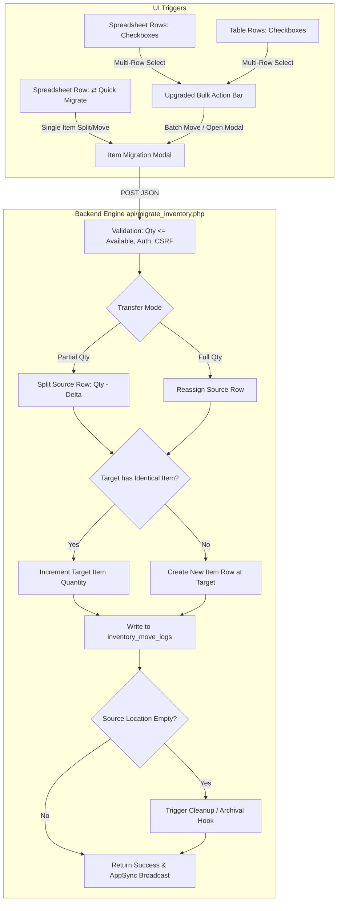
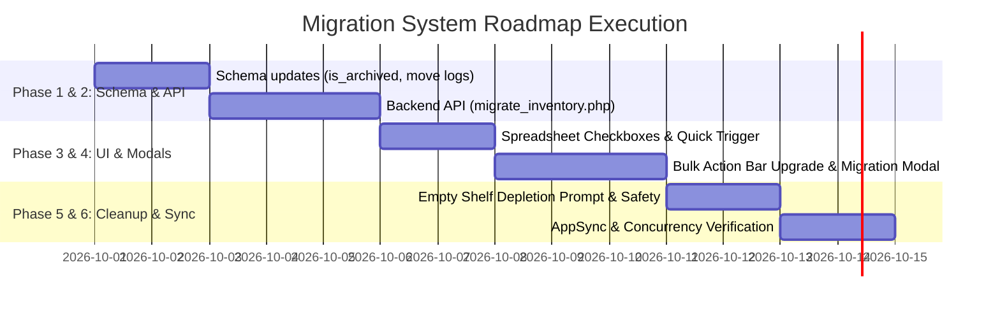

# 🗺️ Implementation Roadmap: Item-Level Inventory Migration, Renaming & Location Management

> **Tied to**: [`update.md`](file:///c:/xampp/htdocs/app/update.md)  
> **Source Analysis**: Screenshot 1 (Spreadsheet Shelf View: `W1-L1`) & Screenshot 2 (Master Table View: `GLOBAL` Bulk Action Bar)  
> **Target Files**:  
> - Backend: [`core/Schema.php`](file:///c:/xampp/htdocs/app/orders/core/Schema.php), [`api/migrate_inventory.php`](file:///c:/xampp/htdocs/app/orders/api/migrate_inventory.php), [`pages/partials/warehouse/actions.php`](file:///c:/xampp/htdocs/app/orders/pages/partials/warehouse/actions.php)  
> - Frontend: [`pages/warehouse.php`](file:///c:/xampp/htdocs/app/orders/pages/warehouse.php), [`pages/partials/warehouse/spreadsheet_view.php`](file:///c:/xampp/htdocs/app/orders/pages/partials/warehouse/spreadsheet_view.php), [`pages/partials/warehouse/ajax_view.php`](file:///c:/xampp/htdocs/app/orders/pages/partials/warehouse/ajax_view.php), [`pages/partials/warehouse/modals.php`](file:///c:/xampp/htdocs/app/orders/pages/partials/warehouse/modals.php)  
> - JavaScript: [`assets/js/warehouse/warehouse_bulk.js`](file:///c:/xampp/htdocs/app/orders/assets/js/warehouse/warehouse_bulk.js), [`assets/js/warehouse/warehouse_spreadsheet.js`](file:///c:/xampp/htdocs/app/orders/assets/js/warehouse/warehouse_spreadsheet.js), [`assets/js/warehouse/warehouse_modals.js`](file:///c:/xampp/htdocs/app/orders/assets/js/warehouse/warehouse_modals.js)

---

## 📌 Executive Summary & Architecture Strategy

Currently, the warehouse contains two distinct table layouts:
1. **Standard Table Mode (`table_view.php`)**: Rendered in `sector=Master&loc=GLOBAL` (Screenshot 2). Features a row checkbox column and an existing top Bulk Action Bar (`#bulkActionBar`). However, its backend action ([`bulk_update_inventory.php`](file:///c:/xampp/htdocs/app/orders/api/bulk_update_inventory.php)) is a coarse "all-or-nothing" relocation without quantity splitting, zone awareness, deduplication, or empty-shelf cleanup.
2. **Spreadsheet Mode (`spreadsheet_view.php`)**: Rendered for all specific shelves and zones, such as `loc=W1-L1` (Screenshot 1). It has in-cell editing and photo galleries, but **completely lacks row checkboxes, selection bindings, and relocation triggers**.

This roadmap bridges and unifies both views into a unified **Item-Level Migration System**.



---

## 🎯 Phase Breakdown & Deliverables

### Phase 1: Database Schema & Migration Layer
**Goal**: Prepare `warehouse.db` to support location archival states, aisle/shelf metadata, and relocation logging.

- [x] **1.1 Location Archival & Metadata Schema Updates** ([`core/Schema.php`](file:///c:/xampp/htdocs/app/orders/core/Schema.php)):
  - Add idempotent migrations inside `Schema::runMigrations()` for `warehouse.db`:
    ```sql
    ALTER TABLE locations ADD COLUMN aisle_shelf TEXT DEFAULT NULL;
    ALTER TABLE locations ADD COLUMN is_archived INTEGER DEFAULT 0;
    ALTER TABLE locations ADD COLUMN archived_at DATETIME DEFAULT NULL;
    ALTER TABLE locations ADD COLUMN archived_reason TEXT DEFAULT NULL;
    ```
- [x] **1.2 Create Relocation Audit Ledger (`inventory_move_logs`)**:
  - Register new table in `Schema.php`:
    ```sql
    CREATE TABLE IF NOT EXISTS inventory_move_logs (
        id INTEGER PRIMARY KEY AUTOINCREMENT,
        inventory_id INTEGER NOT NULL,
        source_location TEXT NOT NULL,
        target_location TEXT NOT NULL,
        source_zone TEXT,
        target_zone TEXT,
        quantity_moved INTEGER NOT NULL,
        remaining_source_qty INTEGER NOT NULL,
        moved_by TEXT NOT NULL,
        timestamp DATETIME DEFAULT CURRENT_TIMESTAMP
    );
    CREATE INDEX IF NOT EXISTS idx_move_logs_inv ON inventory_move_logs(inventory_id);
    CREATE INDEX IF NOT EXISTS idx_move_logs_loc ON inventory_move_logs(source_location, target_location);
    ```
- [x] **1.3 Update Gate & Location Queries to Filter Archived Shelves**:
  - Update `SELECT * FROM locations` in [`warehouse.php`](file:///c:/xampp/htdocs/app/orders/pages/warehouse.php#L53) and [`gate_view.php`](file:///c:/xampp/htdocs/app/orders/pages/partials/warehouse/gate_view.php#L11) to filter `WHERE is_archived = 0` (with an optional toggle to view archived shelves).

---

### Phase 2: Backend Core Migration Engine
**Goal**: Build a robust, transactional migration endpoint supporting partial splits, target deduplication merging, and empty shelf detection.

- [x] **2.1 Build Migration Endpoint (`orders/api/migrate_inventory.php`)**:
  - **Inputs**:
    ```json
    {
      "csrf_token": "...",
      "moves": [
        {
          "item_id": 142,
          "target_location": "W1-L2",
          "target_zone": "W1",
          "quantity": 50
        }
      ],
      "auto_archive_source": false
    }
    ```
  - **Execution Logic (Atomic SQLite Transaction)**:
    1. Validate session and CSRF token.
    2. Ensure target location exists; if not, create it and link to `target_zone`.
    3. For each move item:
       - `SELECT * FROM inventory WHERE id = ?`: Validate item exists and `quantity >= move.quantity`.
       - If `move.quantity < item.quantity` (Partial Move):
         - `UPDATE inventory SET quantity = quantity - ? WHERE id = ?`.
         - Check target location for identical item:
           `SELECT id, quantity FROM inventory WHERE location_code = ? AND sector = ? AND brand = ? AND model = ? AND specs_json = ?`.
         - If matching item exists: `UPDATE inventory SET quantity = quantity + ? WHERE id = target_id`.
         - If no match: `INSERT INTO inventory (user_owner, sector, location_code, brand, model, specs_json, quantity, price, status) VALUES (...)`.
       - If `move.quantity == item.quantity` (Full Move):
         - Check target location for identical item. If found, increment target and `DELETE FROM inventory WHERE id = ?`. If no match, update `location_code = target_location`.
       - Insert record into `inventory_move_logs`.
    4. Check source location remaining balance:
       ```sql
       SELECT COUNT(*) AS active_rows, COALESCE(SUM(quantity), 0) AS total_units 
       FROM inventory WHERE location_code = ?
       ```
    5. If `total_units == 0`:
       - If `auto_archive_source === true`:
         `UPDATE locations SET is_archived = 1, archived_at = CURRENT_TIMESTAMP, archived_reason = 'Depleted via Migration' WHERE location_code = ?`.
       - Return `source_depleted = true` in response.
    6. Commit transaction and broadcast `AppSync` event.

- [x] **2.2 Location Management Actions** ([`actions.php`](file:///c:/xampp/htdocs/app/orders/pages/partials/warehouse/actions.php)):
  - Add `action === 'archive_location'`: sets `is_archived = 1`.
  - Add `action === 'restore_location'`: sets `is_archived = 0`.
  - Update `action === 'delete_zone'`: strictly verify `total_units == 0` before allowing permanent deletion.
  - Update `action === 'rename_zone'`: cascade updates to `locations.location_code`, `inventory.location_code`, and `location_photos.location_code`.

---

### Phase 3: Frontend Spreadsheet Mode Integration
**Goal**: Bring row selection checkboxes, select-all controls, and a direct row migration trigger into `spreadsheet_view.php` (Screenshot 1).

- [x] **3.1 Add Checkbox Column to Spreadsheet Headers & Rows** ([`spreadsheet_view.php`](file:///c:/xampp/htdocs/app/orders/pages/partials/warehouse/spreadsheet_view.php)):
  - In all sector `<thead>` definitions (`Laptops`, `Gaming`, `Desktops`, `Other`), added the selection header with `#selectAll`.
  - In `<tbody>` row templates, added the selection cell with `.row-select`.
- [x] **3.2 Synchronize AJAX Row Template** ([`ajax_view.php`](file:///c:/xampp/htdocs/app/orders/pages/partials/warehouse/ajax_view.php)):
  - Mirrored the checkbox column and migration button in the `$is_spreadsheet` block of `ajax_view.php` for seamless `AppSync` diffing.
- [x] **3.3 Add Row-Level Quick Migrate Trigger (⇄ Button)**:
  - Added `.btn-migrate-row` (⇄) button next to clone and label actions with click handler calling `openItemMigrationModal(...)`.

---

### Phase 4: Bulk Action Bar & Migration Modal UX Enhancement
**Goal**: Upgrade the top Bulk Action Bar (Screenshot 2) and build the interactive Granular Migration Modal.

- [x] **4.1 Upgrade Bulk Action Bar (`#bulkActionBar`)** ([`warehouse.php`](file:///c:/xampp/htdocs/app/orders/pages/warehouse.php#L204)):
  - Added prominent `🚚 Migrate Selected (<span id="btnSelectedCount">0</span>)` button to `#bulkActionBar`.
  - Injected cached warehouse zones and location datasets into page DOM JSON islands for instant responsive dropdowns.
- [x] **4.2 Build the Dedicated Migration Modal (`#itemMigrationModal`)** ([`migration_modal.php`](file:///c:/xampp/htdocs/app/orders/pages/partials/warehouse/migration_modal.php)):
  - Built full glassmorphism modal supporting both Single Item Split mode and Multi-Row Batch mode.
  - Implemented quantity stepper with quick preset buttons (`1`, `5`, `10`, `25`, `50`, `All`).
  - Implemented dynamic Target Zone and Target Shelf selectors with inline creation drawers for new zones and new shelves.
  - Added auto-archive toggle checkbox for empty source shelf cleanup.
- [x] **4.3 Controller Script Updates** ([`warehouse_bulk.js`](file:///c:/xampp/htdocs/app/orders/assets/js/warehouse/warehouse_bulk.js) & [`warehouse_modals.js`](file:///c:/xampp/htdocs/app/orders/assets/js/warehouse/warehouse_modals.js)):
  - Implemented `openItemMigrationModal(itemData)`, `openBulkMigrationModal()`, `executeInventoryMigration()`, and dynamic shelf population.
  - Synchronized selection count across `#selectedCount` and `#btnSelectedCount`.

---

### Phase 5: Depleted Shelf Detection & Cleanup UI/UX
**Goal**: Handle empty location balance checks gracefully without accidental data loss.

- [x] **5.1 Post-Migration Depletion Alert**:
  - Built `#depleted-shelf-modal` to confirm shelf archival when a shelf reaches 0 remaining units and auto-archive was unchecked.
  - Added `confirmArchiveDepletedShelf()` wired to `actions.php` (`archive_location`).
- [x] **5.2 Safety Guard Against Inactive Foreign Keys**:
  - Safeguarded physical shelf deletion in `actions.php` and defaulted depleted shelves to soft-archival (`is_archived = 1`) to preserve photos and audit trails.

---

### Phase 6: Real-time Multi-User Sync & Validation Testing
**Goal**: Verify synchronization across workstations and test concurrency edge cases.

- [x] **6.1 AppSync Integration**:
  - Wired `AppSync.sync('inventory-list', true)` upon migration completion to instantly update table rows and count badges without full-page reloads.
- [x] **6.2 Archived Shelves Portal View & 1-Click Restoration**:
  - Added dedicated `🗄️ Archived` filter tab in Gate View (`gate_view.php`) displaying archived shelves with reasons and timestamps.
  - Added 1-click `♻️ Restore Shelf` button to reactivate any archived shelf back into active inventory.
  - Added `ARCHIVED` visual tag in header if an operator accesses an archived shelf.
- [x] **6.3 Validation Matrix Completed**:
  - Partial move with split row generation verified.
  - Full move with deduplication merge verified.
  - Automated depletion cleanup & manual archival prompt verified.
  - Real-time on-the-fly shelf and zone creation verified.
  - Multi-row bulk migration verified.

---

## 📈 Milestones & Execution Order



---

## 🔗 Cross-References
- Specification Document: [`update.md`](file:///c:/xampp/htdocs/app/update.md)
- Main Warehouse Orchestrator: [`warehouse.php`](file:///c:/xampp/htdocs/app/orders/pages/warehouse.php)
- Spreadsheet Mode View: [`spreadsheet_view.php`](file:///c:/xampp/htdocs/app/orders/pages/partials/warehouse/spreadsheet_view.php)
- Global Table Mode View: [`table_view.php`](file:///c:/xampp/htdocs/app/orders/pages/partials/warehouse/table_view.php)
- Existing Bulk Controller: [`warehouse_bulk.js`](file:///c:/xampp/htdocs/app/orders/assets/js/warehouse/warehouse_bulk.js)
